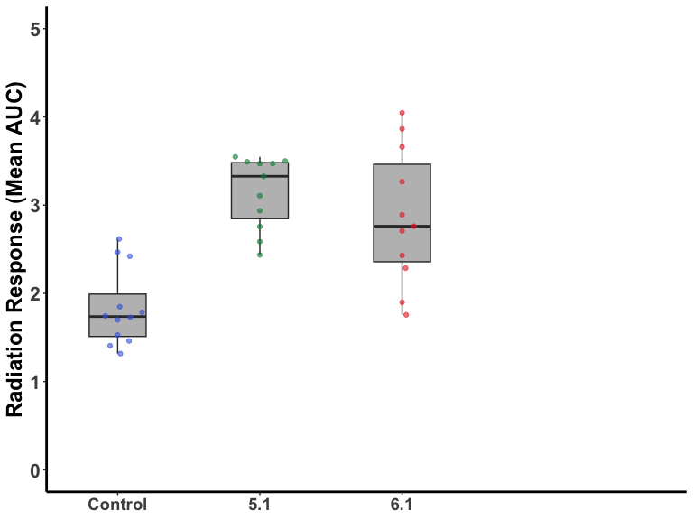
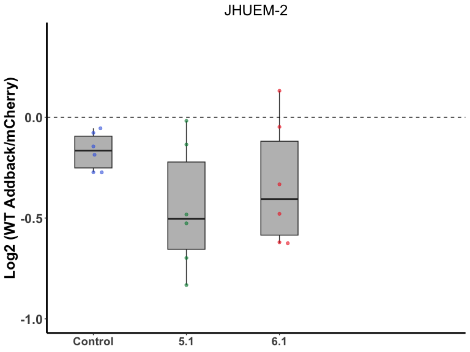
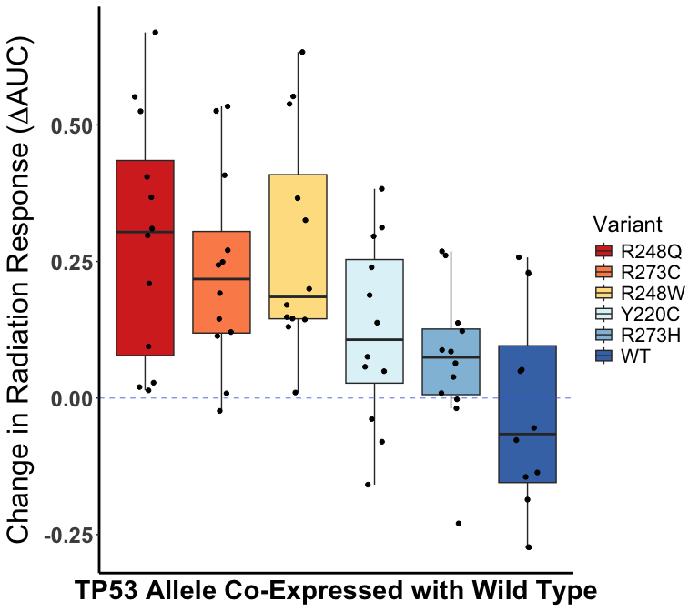

Figure 1B, 1E, 2B, Boxplots and waterfall
================
Aaron Petty
2025-08-18

### *Boxplot and swarmplot for JHUEM1, JHUEM2 AUC data (Figure 1B)*

#### Read in excel file with JHUEM1 and JHUEM2 variant AUC data in long format

``` r
JHLog <- read_xlsx("JHUEM1, 2 NTC + variants, Log2 AUC data, 11-30-21.xlsx", 2)
```

#### Delete Cell Line column and rename new first column

``` r
JHLog <- JHLog[,-1]
names(JHLog)[1] <- "KO"
```

#### Pivot table to long form and convert KO column to factor

``` r
JHLog <- melt(JHLog, id= c("KO"))
JHLog$KO <- factor(JHLog$KO, levels= c("NTC", "KO 5.1", "KO 6.1"), 
                   labels= c("Control", "5.1", "6.1"))
```

#### Generate boxplot and beeswarm plot

``` r
JSw <- ggplot(JHLog, aes(x= KO, y= value)) + 
  theme_classic() + scale_y_continuous(limits= c(0, 5), breaks= seq(0, 5, 1)) +
  scale_x_discrete(expand= expansion(mult= c(0.25, 1))) + labs(title= NULL, x= NULL, y= "Radiation Response (Mean AUC)") +
  theme(axis.text.y= element_text(face= "bold", size= 16), axis.title.y= element_text(size= 18, face= "bold"), axis.text.x = element_text(face = "bold", size= 14)) +
  theme(legend.position= "none", axis.line = element_line(size= 1))
JSw <- JSw + geom_boxplot(fill= "grey", width= 0.4)
JSw <- JSw + geom_beeswarm(aes(color= KO), priority = "density", cex= 3) + scale_color_manual(values = alpha(c("royalblue", "springgreen4", "firebrick2"), 0.6))
print(JSw)
```



------------------------------------------------------------------------

### *Boxplots for JHUEM2 (Figure 1E)*

#### Read in excel file with JHUEM2 variant Log2 AUC/mCherry data

``` r
JHLog <- read_xlsx("JHUEM1, 2 NTC + variants, Log2 AUC data, 11-30-21.xlsx", 3)
```

#### Delete cell name column and change column name

``` r
JHLog <- JHLog[,-1]
names(JHLog)[1] <- "KO"
```

#### Pivot table to long form and convert KO column to factor

``` r
JHLog <- melt(JHLog, id= c("KO"))
JHLog$KO <- factor(JHLog$KO, levels= c("NTC", "KO 5.1", "KO 6.1"), 
                   labels= c("Control", "5.1", "6.1"))
```

#### Generate boxplot and beeswarm plot

``` r
JH2 <- ggplot(JHLog, aes(x= KO, y= value)) + 
  theme_classic() + scale_y_continuous(limits= c(-1, 0.4), breaks= seq(-1, 0.4, 0.5)) +
  scale_x_discrete(expand= expansion(mult= c(0.25, 1))) + labs(title= "JHUEM-2", x= NULL, y= "Log2 (WT Addback/mCherry)") +
  theme(axis.text.y= element_text(face= "bold", size= 16), axis.title.y= element_text(size= 18, face= "bold"), axis.text.x = element_text(face = "bold", size= 14), plot.title = element_text(size= 18, hjust= 0.5)) +
  theme(legend.position= "none", axis.line = element_line(size= 1))
JH2 <- JH2 + geom_boxplot(fill= "grey", width= 0.4)
JH2 <- JH2 + geom_beeswarm(aes(color= KO), priority = "density", cex= 3) + scale_color_manual(values = alpha(c("royalblue", "springgreen4", "firebrick2"), 0.6))
JH2 <- JH2 + geom_hline(linetype= "dashed", yintercept = 0.00) 
print(JH2)
```



------------------------------------------------------------------------

### *Waterfall boxplots of Log2 AUC/mCherry for JHUEM1 and JHUEM2 (Figure 2B)*

#### Read in excel file with JHUEM1 and JHUEM2 variant Log2 AUC/mCherry data in long format

``` r
JHVar <- read_xlsx("JHUEM1, 2 NTC + variants, Log2 AUC data, 11-30-21.xlsx", 1)
```

#### Pivot data table to long form

``` r
JHVar <- JHVar[,-1]
JHVar <- melt(JHVar, id= c('Variant'))
```

#### Group cell lines by variant and calculate Median, SD, and SEM

``` r
Grouped <- JHVar %>%
  group_by(Variant) %>%
  summarise(Median= median(value), SD= sd(value)) %>%
  mutate(SEM= SD/(sqrt(4)))
```

#### Order rows by decreasing median Log2 AUC/mCherry value and number rows from 1-6

``` r
Grouped <- Grouped[order(Grouped$Median, decreasing = TRUE),]
levels <- Grouped$Variant[1:6]
```

#### Convert Variant column to a factor and set order of variants

``` r
JHVar$Variant <- factor(JHVar$Variant, 
                        levels= levels)
```

#### Generate waterfall plot

``` r
J <- ggplot(JHVar, aes(x= Variant, y= value)) + theme_classic() +
  labs(title= NULL, 
       x= "TP53 Allele Co-Expressed with Wild Type", y= expression(paste("Change in Radiation Response (", Delta, "AUC)"))) +
  theme(axis.ticks.x= element_blank(), axis.text.x = element_blank(), axis.title.x = element_text(size= 22, face= "bold")) +
  theme(axis.text.y = element_text(size= 18, face= "bold"), axis.title.y = element_text(size= 24, face= "bold")) +
  theme(legend.text = element_text(size= 16), legend.title = element_text(size= 18), plot.title = element_text(size= 18), axis.line = element_line(size= 1))

J <- J + geom_boxplot(aes(fill= Variant), outliers= FALSE) + 
  scale_fill_brewer(palette = "RdYlBu") +
  scale_color_brewer(palette = "RdYlBu") + 
  geom_hline(colour= alpha("royalblue", 0.6), linetype= "dashed", yintercept = 0.00) +
  geom_jitter(stat= "identity", width= 0.15)
print(J)
```



------------------------------------------------------------------------

#### **Built with Version 4.4.3**
