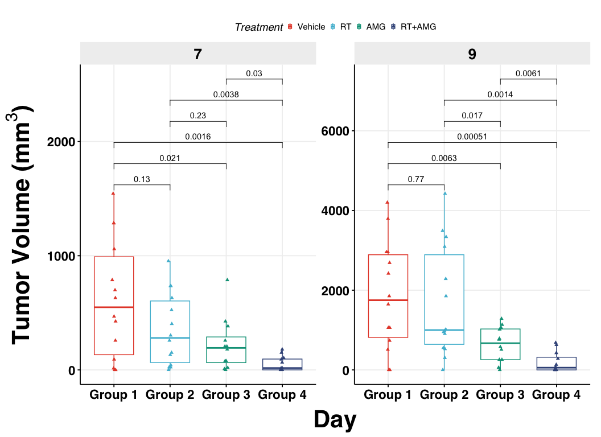
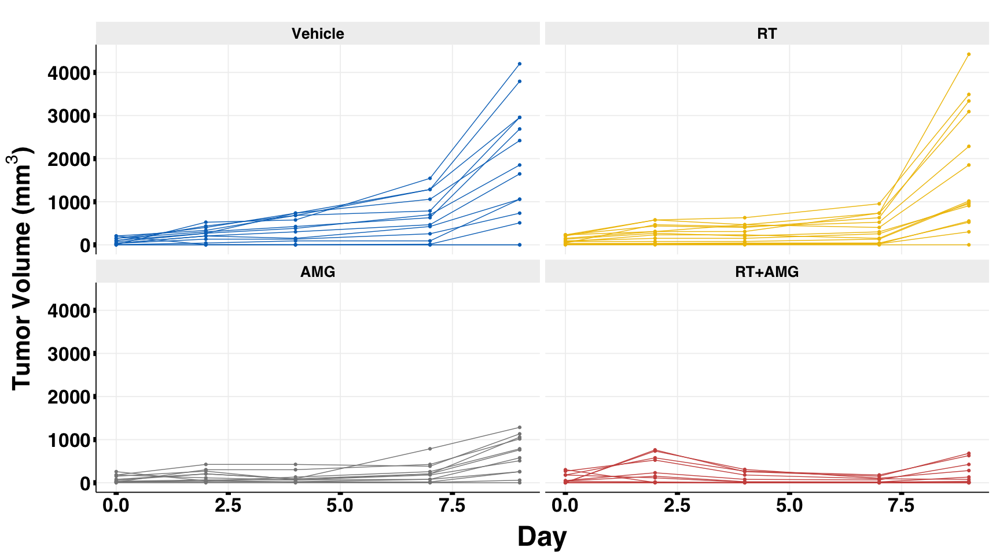
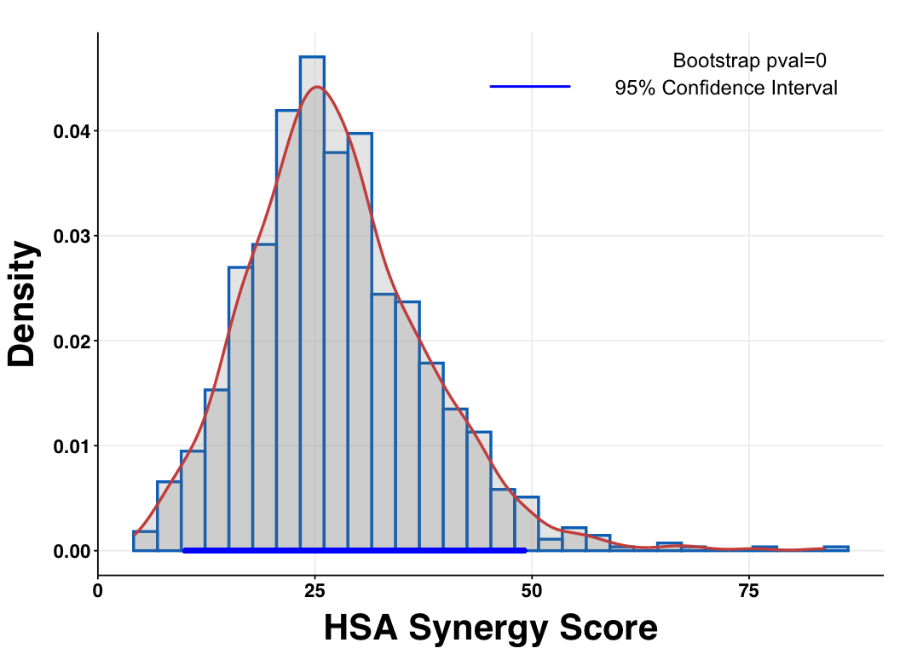
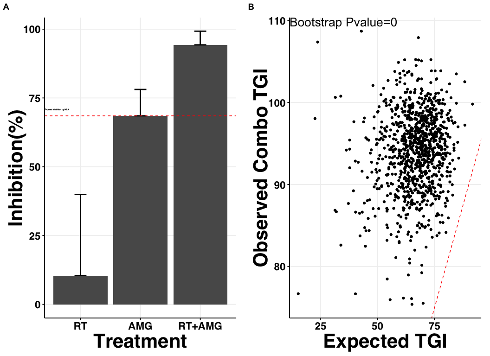
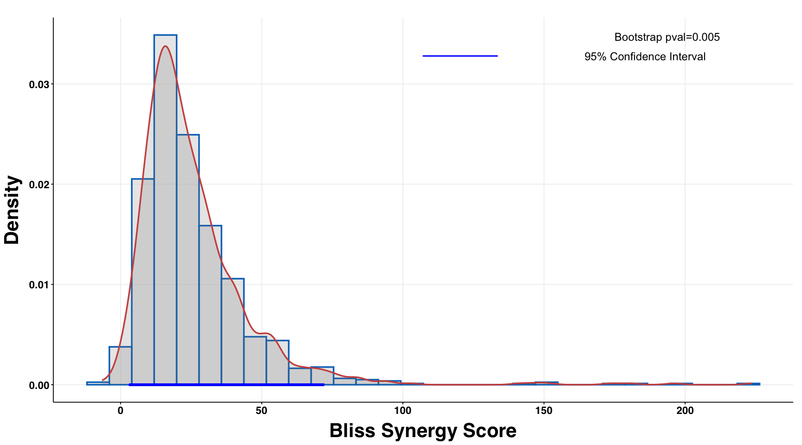
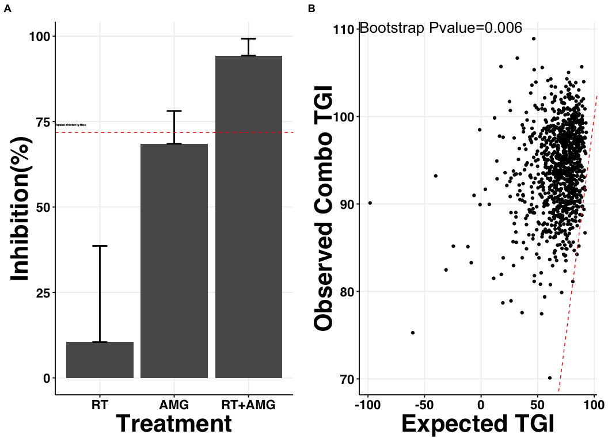

*InvivoSyn analysis*, JHUEM2 AMG+RT, Figure 5, S5, S6
================
Aaron Petty
2025-08-13

### *Boxplots and growth curves with tumor growth data*

#### Read in csv file with tumor growth data and calculate tumor volume metrics

``` r
library(invivoSyn)
library(tidyverse)
tv <- read_tv("JHUEM2, AMG + RT, D17-26.csv")
```

#### Boxplot with only Day 7 and Day 9 (Figure 5B)

``` r
tv_79 <- tv[which(tv$Day== 7 | tv$Day== 9),]
cmps=as.list(as.data.frame(combn(as.character(levels(tv_79$Group)),2)))
n_day=length(unique(tv_79$Day))
col_n=ceiling(sqrt(n_day))
row_n=ceiling(n_day/col_n)
p=ggpubr::ggboxplot(tv_79,x='Group',y='TV',add=c('jitter'),color='Treatment',add.params = list(shape=17),xlab='Day',repel = TRUE)+facet_wrap(~Day,scales = 'free_y')+
  ggpubr::stat_compare_means(method='t.test',comparisons = cmps,aes(label = paste0("p=", ..p.format..)),label.x.npc = 'left',label.y.npc = 'top')+
  theme_Publication()+ggsci::scale_color_npg()

p <- p + labs(y= expression(bold(paste("Tumor Volume (", mm^3, ")"))))

print(p)
```



#### Generate tumor growth plots (Supplementary Figure 5)

``` r
p1=tv %>% ggplot()+aes(Day,TV,group=Mouse,color=Group) + labs(y= expression(bold(paste("Tumor Volume (", mm^3, ")"))))+geom_point()+geom_line()+
  theme_Publication()+facet_wrap(~Treatment)+
  ggsci::scale_color_jco() + theme(axis.title.x=element_text(face = "bold",size = rel(1.6)),axis.text=element_text(size=rel(1.8)),axis.ticks=element_line(size=rel(5)))+
  theme(legend.position = 'none')
print(p1)
```



------------------------------------------------------------------------

### *Synergy analyses with Tumor Growth Inhibition (TGI) data*

#### Generate density plot for HSA Synergy Scores with Day 9 TGI (Figure 5C)

``` r
TGI_lst <- getTGI(tv, sel_day = 9)
method <- "HSA"
bsTGI_all=TGI_lst$bsTGI_r$t
colnames(bsTGI_all)=c('D1','D2','Combo')
bsTGI_all = bsTGI_all %>% as.data.frame() %>% mutate('expected_TGI'=switch(method,"Bliss"=D1+D2-D1*D2,"HSA"=pmax(D1,D2),"RA"=D1+D2))
bsTGI_all = bsTGI_all %>% mutate(Synergy_score=Combo-expected_TGI)
bsTGI_all = bsTGI_all*100 #in percentage
pval=round(1-sum(bsTGI_all$Combo>bsTGI_all$expected_TGI)/nrow(bsTGI_all),4)

p2= plot_density(bsTGI_all, sel_var = "Synergy_score", pval= pval)
p2 <- p2 + xlab("HSA Synergy Score") + theme_Publication()

print(p2)
```



#### Generate dot plot for bootstrap analysis on Day 9 TGI using HSA model (Supplementary Figure 6)

``` r
HSA_Synergy <- TGI_synergy(TGI_lst, method = "HSA")
```



#### Generate density plot for Bliss Synergy Scores with Day 9 TGI (Figure 5C)

``` r
TGI_lst <- getTGI(tv, sel_day = 9)
method <- "Bliss"
bsTGI_all=TGI_lst$bsTGI_r$t
colnames(bsTGI_all)=c('D1','D2','Combo')
bsTGI_all = bsTGI_all %>% as.data.frame() %>% mutate('expected_TGI'=switch(method,"Bliss"=D1+D2-D1*D2,"HSA"=pmax(D1,D2),"RA"=D1+D2))
bsTGI_all = bsTGI_all %>% mutate(Synergy_score=Combo-expected_TGI)
bsTGI_all = bsTGI_all*100 #in percentage
pval=round(1-sum(bsTGI_all$Combo>bsTGI_all$expected_TGI)/nrow(bsTGI_all),4)

p3= plot_density(bsTGI_all, sel_var = "Synergy_score", pval= pval)
p3 <- p3 + xlab("Bliss Synergy Score") + theme_Publication()

print(p3)
```



#### Generate dot plot for bootstrap analysis on Day 9 TGI using Bliss model (Supplementary Figure 6)

``` r
Bliss_Synergy <- TGI_synergy(TGI_lst, method = "Bliss")
```



------------------------------------------------------------------------

### *HSA AUC Synergy density plots (Figure 5D)*

``` r
tv_AUC <- read_tv("JHUEM2, AMG+RT, D14-26.csv")
AUC_lst <- get_mAUCr(tv_AUC)
AUC_Synergy <- AUC_synergy(AUC_lst, t= 12, method= "HSA")
```


------------------------------------------------------------------------

#### Code utilized the *invivoSyn* package installed from the following address: <https://github.com/maobinchen/invivoSyn>

- Mao, B. & Guo, S. Statistical Assessment of Drug Synergy from In Vivo
  Combination Studies Using Mouse Tumor Models. Cancer Res. Commun. 3,
  2146–2157 (2023).

#### **Built with Version 4.4.3**
